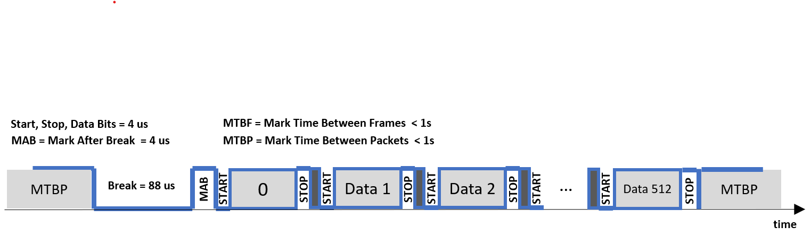

Schematics - MIDI 2 DMX Platform
================================

L476RG version
--------------

DMX extension - revision 3
~~~~~~~~~~~~~~~~~~~~~~~~~~

.. caution::
   On this version, the nRF24 connector can not be used. You need the MIDI extension.

.. note::
   The DMX extension is a motherboard for the STM Nucleo board. It uses the Morpho connectors.
   
The Nucleo morpho connectors schematic :
   

The output DMX signal is generated as mentionned in the next figure, to respect the timing of the protocol.

Four signals are used to generate the perfect timing : *start*, *out_s*, *enable* and *TX* (serial output used for transmitting data).

A MAX485 low-power transceiver is used for RS-485 communication on the DMX bus.

Three potentiometers (*RV1*, *RV2* and *RV3*) can be used on the board and are connected to three analog inputs.

Two analog inputs can also be used (*PitchIn* - J1 - and *VolumeIn* - J7). The *VolumeIn* input is a filtered (15Hz high-pass first order filter) input with an offset compatible with Nucleo analog-to-digital converter.

An **external power supply** between 7 to 12V can be used on the **J6** connector.

MIDI extension
~~~~~~~~~~~~~~

.. note::
   The MIDI extension uses the Arduino connectors of the Nucleo board.

F767ZI version
--------------

